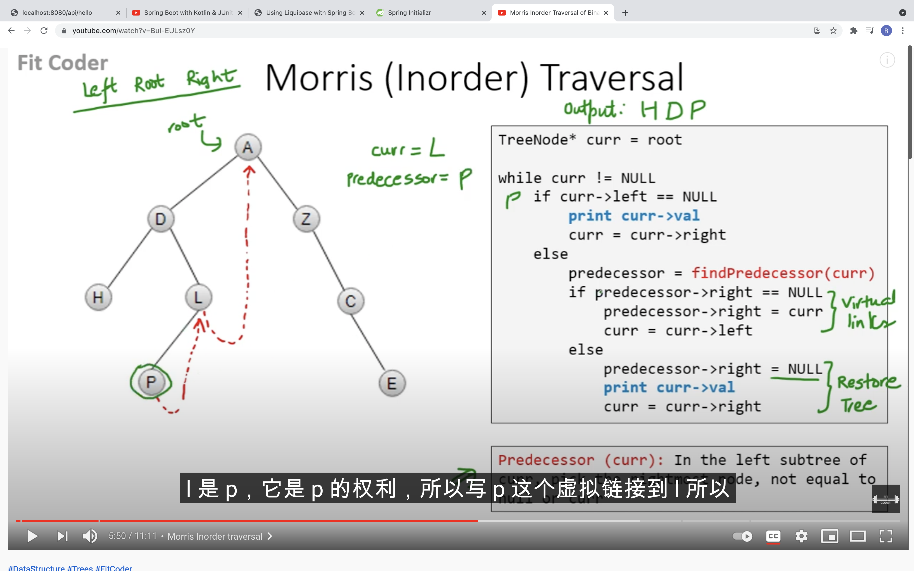
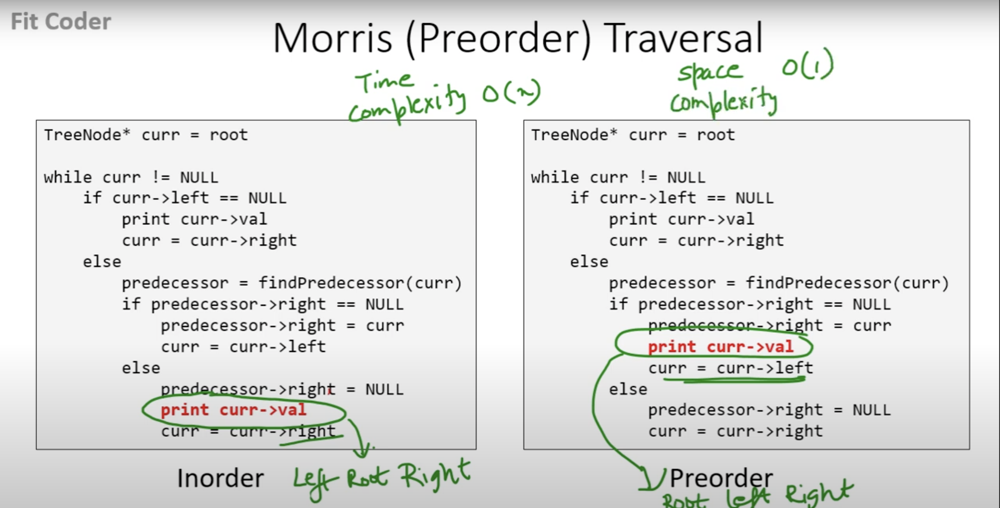

144. 二叉树的前序遍历
94. 二叉树的中序遍历
145. 二叉树的后序遍历

**首先都要先检查root是不是空**

**前序遍历**:
1. 每次从栈里弹出一个节点cur
2. 打印
3. 先压右再亚左
4. 周而复始

1.push root

2.while里:
1) pop and print
2) if right not null -> push
3) if left not null -> push

**中序遍历**:一直把cur更新为left，只要left为空就pop然后把cur更新为pop出去的node的right

**后序遍历**:只需要调整一下先序遍历的代码顺序，就变成中右左的遍历顺序，然后在反转result数组，输出的结果顺序就是左右中了，如下图：

或者每次弹出后都放在收集栈中，然后打印收集栈内元素。

**Morris:**

InOrder
    
两种情况：1.没有左子树2.左边遍历完指向自己之后，link是指向中序遍历后一个元素

PreOrder

换下print的位置就行：  

根左右
左根右
左右根

首先不停地把左边届都压进栈里（一路顺着left往下走的叫左边界），

