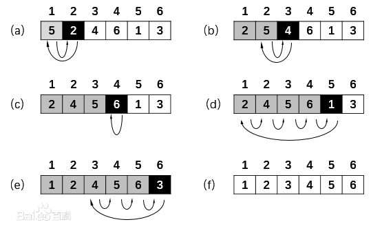
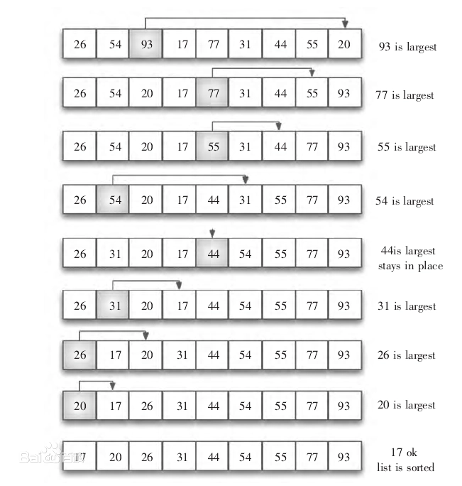

1. **快速排序(Quicksort)**
   找到一个pivot，把小的都放左边，大的都放右边
   
2. **插入排序(Insertion sort)**  
   将一个记录插入到已经排好序的有序表中
   
3. **归并排序(Merge Sort)**
4. **冒泡排序(Bubble Sort)**
5. **选择排序(Selection Sort)** （不稳定）  
     
   从待排序的数据元素中选出最小（或最大）的一个元素，存放在序列的起始（末尾）位置，然后再从剩余的未排序元素中寻找到最小（大）元素，然后放到已排序的序列的起始（末尾）。以此类推，直到全部待排序的数据元素的个数为零
   

 